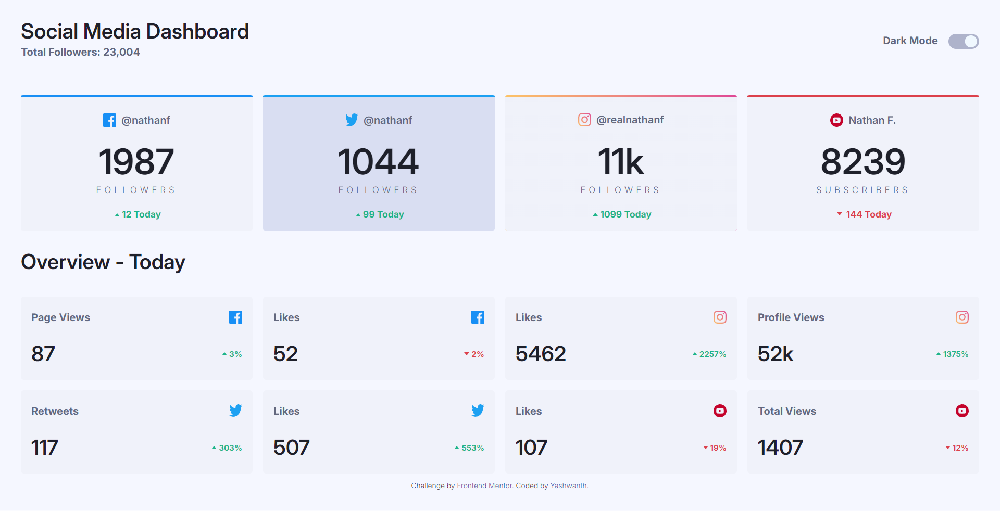
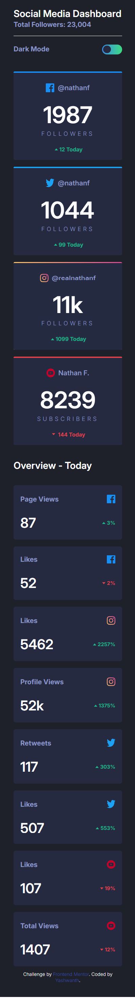
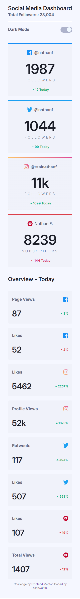

# Frontend Mentor - Social media dashboard with theme switcher solution

This is a solution to the [Social media dashboard with theme switcher challenge on Frontend Mentor](https://www.frontendmentor.io/challenges/social-media-dashboard-with-theme-switcher-6oY8ozp_H). Frontend Mentor challenges help you improve your coding skills by building realistic projects.

## Table of contents

- [Overview](#overview)
  - [The challenge](#the-challenge)
  - [Screenshot](#screenshot)
  - [Links](#links)
- [My process](#my-process)
  - [Built with](#built-with)
  - [What I learned](#what-i-learned)
  - [Continued development](#continued-development)
  - [Useful resources](#useful-resources)
- [Author](#author)
- [Acknowledgments](#acknowledgments)

**Note: Delete this note and update the table of contents based on what sections you keep.**

## Overview

### The challenge

Users should be able to:

- View the optimal layout for the site depending on their device's screen size
- See hover states for all interactive elements on the page
- Toggle color theme to their preference

### Screenshot

	

### Links

- Solution URL: [Github](https://social-media-dashboard-fem-sy.netlify.app/)
- Live Site URL: [Netlify](https://social-media-dashboard-fem-sy.netlify.app/)

## My process

### Built with

- Semantic HTML5 markup
- SCSS: Custom functions and properties
- Flexbox
- CSS Grid
- Mobile-first workflow

### What I learned

1. prefers-color-scheme: I used it to obtain the default state of the user's browser.
2. localStorage: Used to store the theme of the website over sessions.

### Continued development

I will probably use the same code (although a bit refactored as I gain more experience in JS) to change the theme of a website.

### Useful resources

- [The best light/dark mode theme toggle in JavaScript ](https://dev.to/whitep4nth3r/the-best-lightdark-mode-theme-toggle-in-javascript-368f)by Salam Alam-Naylor on dev.to - I came across this article while perusing ways to toggle the theme of a website; a concise article with a load of information, it helped me optimise the theme switching of a website, when compared to my previous project.

## Author

- Website - [Yashwanth](httphttps://github.com/yashwanth-srinivasas://www.your-site.com)
- Frontend Mentor - [@yashwanth-srinivasa](https://www.frontendmentor.io/profile/yashwanth-srinivasa)
